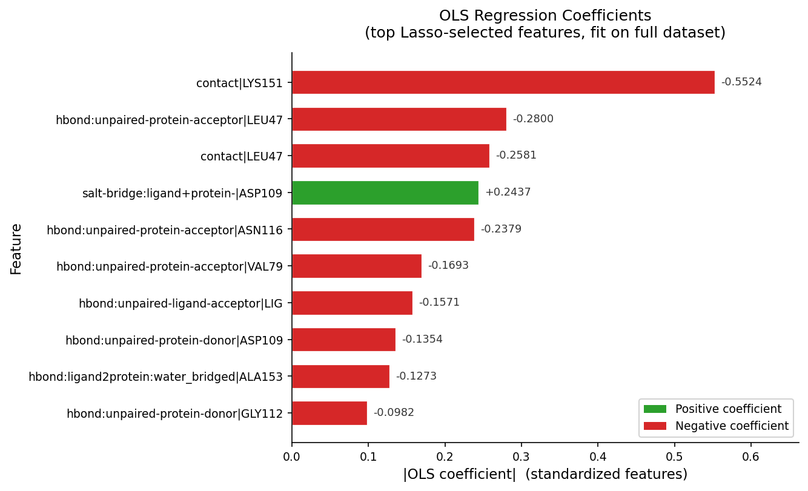

# mdfitml

MDFitML is a framework for small-molecule potency prediction derived from protein-ligand simulation fingerprints (SimFPs). Based on the [MDFit](https://dx.doi.org/10.1007/s10822-024-00564-2) workflow, it is now significantly improved in terms of end-to-end automation and results interpretation. 

The basic strategy is to identify top-N (e.g. N=10) features that most contribute to separating strong from weak binders and to use these for potency prediction by ordinary least-squares (OLS) regression. At the moment, the script provided performs only an L1-regularized regression on a feature matrix. This will soon be expanded by allowing the user to run L2-regularized, random-forest, or XGBoost regression models. However, our initial results indicate that the L1-regularized regression for feature elimination performs formidably by eliminiating irrelevant features, thus not overfitting to training data (a manuscript is in preparation).

MDFitML achieves R2 values comparable or superior to conventional alchemical binding free energy methods, particularly when taking transient interactions like water-bridged Hbonds into account. Of course, it is agnostic toward the MD simulation and analysis software, as long as the feature matrix follows the formatting guidelines (see `data/`).  

### Usage 

The script can be run like this: 
`python run_mdfitml_lasso.py   --data_feat  merged_data.csv   --data_obs  obs_pic50.csv   --top_N 10`

The flags `--data_feat` and `--dat_obs` handle the input files, i.e., feature matrix and response values, respectively, and `--top_N` selects the number of features with the highest regression coefficients to be used for the OLS regression. 

Under the hood, a nested leave-one-out cross-validation (LOO-CV) is performed to optimize hyperparameters (inner loop) before applying the model (outer loop). Features are ranked by mean absolute regression coefficient across all folds, followed up by an OLS (trained and evaluated by LOO-CV) on the top-N features. Ranked features, prediction values, and performance metrics are reported.

### Results

MDFitML prints predictions to STDOUT for each outer fold of the LOO-CV, first for the L1 regression and then for the OLS regression. Performance metrics are reported in `results_mdfitml.txt`. Important results are the top-N features ranked by absolute regression coefficients from the L1 regression and the OLS regression performance based on the top-N features, for instance, in terms of R2, MAE, or Kendall's  $\tau$. `plot_mdfitml.png` is a bar chart of the feature ranking (see below for the example data).
  

